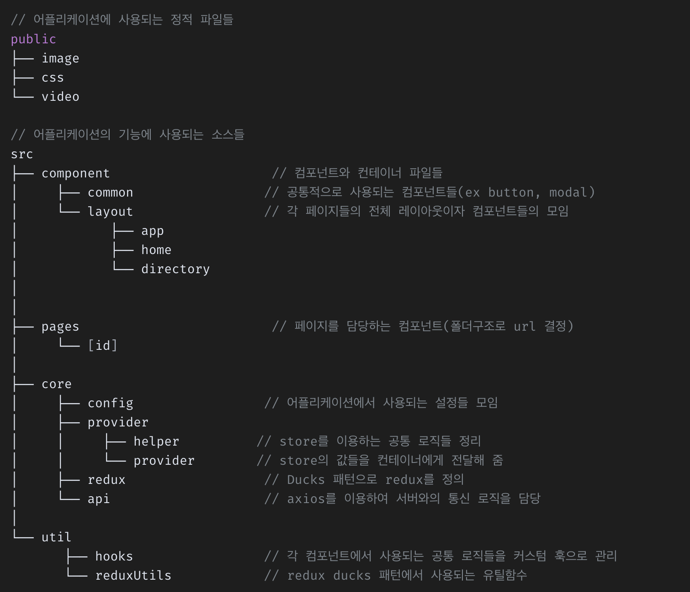

# < Barfdog : Web Shopping Mall >


### Install
<br/>

> Next JS Package
```powerShell
$ npx create-next-app .
```

<br/>

> Global Install
```powerShell
$ npm i -g nodemon
```


<br/>

---

### Libarary
<br/>

Library | Version | Category | Note
:--:|:--:|:--:|:--:|
Node | 14.17.4 | npm | -
next.js | 12.1.4(lastest) | npx | 
react | lastest<br/>18.0.0 (22.04.11기준) | npx | crete-next-app 생성 시 자동 설치
react-dom | lastest<br/>18.0.0 (22.04.11기준) | npx | crete-next-app 생성 시 자동 설치
typescript | ^4.6.3 | npm | 주요 API통신 시 사용(예정)

<br/>
<br/>

---
### COMMON Setting in Style
<br/>

### VSCODE Extension 
1. Better Comments 설치
<div style="background-color:rgba(0,0,0,.25); padding: 10px;">
      <p style="color:red; text-decoration:none">// ! :  주석색깔 붉은색표기됨(주의사항 표기)</p>
      <p style="color:green; text-decoration:none">// * 주석색깔 초록색: 참고사항 표기</p>
</div>

<br/>

2. Fast Arrow
```js
- JS arrow 함수 사용 시, snipet제공
```


<br/>

4. ES7+ React/Redux/React-Native
```js
- React Snippet 제공
- ex. rfce 입력 시 기본 component형식 자동완성

import React from 'react'

function index() {
  return (
    <div>index</div>
  )
}
export default index
```

<br/>

### Prettier

```bash
- 기본 설정 그대로 사용
- 사용에 불필요할 경우 disabled
- 공통된 코드 구성 Format 생겼을 경우 추가
```
<br/>

### ESslint

```plaintext
-
- 
```


<br/>
<br/>
<br/>


# 네이밍 규칙

<br/>

> 공통 네이밍 규칙
<br/>

잘못된 예 | 올바른 예 | 설명
|:--:|:--:|:--:|
| Tit_pop.html <br/> 03_btn_more.gif <br/> *-hidden-obj |  tit-section | 시작이름은 영문 대문자, 숫자, 특수문자로 시작할 수 없다.(파일 및 폴더 제외)
| cancle_btn_off_01 | btn_cancle_01_off | 네이밍의 조합은 <b  style="font-size:15px; margin:0 4px">'형태_의미_순서_상태'</b>를 기본 순서로 사용한다.
| hidden_obj | hidden-obj | CSS에서 네이밍 규칙의 하이픈(-) 조합을 사용한다. <br/> CSS.MODULE에서 네이밍 규칙의 언더바(_) 조합을 사용한다.
| cyber_center_1,<br/>cyber_center_2 | cyber_center_01,<br/>cyber_center_02 | 1, 2과 같은 한자리 정수는 사용하지 않으며 01, 02과 같이 사용한다.
| box-type01,<br/> box-type02,<br/> box-type03 | box-type,<br/> box-type02,<br/> box-type03 | '동일한 이름'의 네이밍의 경우 가장 뒤에 숫자를 사용하여 분류지어 사용할 수 있으며 첫 번째 파일은 숫자를 생략하여 사용할 수 있다

<br/>
<br/>
<br/>


 > 아이디 (id)

잘못된 예 | 올바른 예
|:--:|:--:|
| error_Mesage |  errorMesage
| control_center |  controlCenter
| checkbox_3 |  checkbox-3


```bash
1. 시작의 이름은 영문 소문자를 사용하되 두 번째 단어부터 첫 번째 문자를 대문자로 처리하는 기법(카멜 케이스)을 사용한다.
2. 동일한 이름의 id는 문서에서 한번만 사용이 가능하다.
3. 지정된 레이아웃을 제외한 스타일 지정을 위하여 id를 사용하지 않는다.
4. 앵커로서 사용되는 엘리먼트는 id 지정이 가능하다.
```

<br/><br/><br/>


 > 클래스명 (class)

잘못된 예 | 올바른 예
|:--:|:--:|
| error-Mesage |  error-mesage
| control_center |  control-center


```js
1. 시작의 이름은 영문 소문자를 사용하며 두 번째 단어부터 하이픈(-)으로 연결하며 대문자는 사용하지 않는다.
2. 영문 소문자, 숫자, 하이픈(-)만 사용할 수 있다.
3. 하이픈(-)은 2개 이상의 단어를 조합할 때만 사용한다.
4. 하이픈(-)을 이용하여 3단계를 초과하여 사용하는 방법은 지양한다.
5. 숫가자 없으면 '01'이라는 숫자가 생략된 것으로 간주한다.
6. 다중의 클래시 지정을 허용하며 최대 3개 이상 사용하지 않도록 주의한다.
```


<br/><br/><br/>


 > 파일명 (filename)

잘못된 예 | 올바른 예
|:--:|:--:|
| Mypage.jsx |  mypage.jsx
| edit_my_password.jsx |  editMyPassword(edit-my-password).jsx
| loginSectionToSocial.jsx |  loginWithSNS.jsx
| barfWorry.png |  home_barfWorry_01.png


```js
1. 보통 directory 파일명은 소문자로 한다.
2. CamelCase또는 하이픈을 사용한다.
3. 불분명한 이름은 짓지않는다(ex. loginSection2). 어쩔 수 없이 이름이 길어지더라도 명확한 이름을 사용한다.
4. 이미지 파일명은 페이지 이름\/이미지네이밍\/순서를 확인할 수 있도록 명명한다.(ex. "home_barfWorry_01.png")
5. 이미지 파일명 중 순서는 하나의 섹션 내에서 동일한 카테고리가 없을 경우 생략할 수 있다. "home_barfWorry.png"를 사용하여 명명한다.
6. Directory 자체가 React 컴포넌트가 바로 들어있는 폴더라면, 폴더 이름을 대문자로 시작한다.
7. Directory 자체가 React 컴포넌트가 들어있지 않고, 포함돼있다면, 소문자 단수로 표기한다.
```


<br/><br/><br/>


 ##  Component 폴더 설명

 <br/>


### /src/components
```bash
- 재사용이 가능한 컴포넌트
- 다양한 곳에 사용 가능한 범용컴포넌트
```

<br/>

### /src/components/atoms
```bash
- 더 이상 쪼갤 수 없는 가장 작은 단위의 컴포넌트
```
<br/>

### /src/components/common
```bash
- 페이지별 공통적으로 사용하는 컴포넌트
```
### /src/containers
```bash
- 재사용이 불가능한 컴포넌트
- ex. 약관, 회사 소개 등의 정적 페이지
```


<br/><br/><br/><br/><br/>

# 파일구조

```
// 어플리케이션에 사용되는 정적 파일들
public 						
├── img
├── css
└── video

// 어플리케이션의 기능에 사용되는 소스들
src
├── pages                         // 페이지를 담당하는 컴포넌트(폴더구조로 url 결정)
│	  └── [id]                        			 
├── component                     // 컴포넌트와 컨테이너 파일들
│     ├── common                 // 공통적으로 사용되는 컴포넌트들(ex button, modal)
│     └── layout                 // 각 페이지들의 전체 레이아웃이자 컴포넌트들의 모임
│            ├── home
│            └── directory
│		                  
│				

│
├── core  
│     ├── api                    // axios를 이용하여 서버와의 통신 로직을 담당
│     ├── config                 // 어플리케이션에서 사용되는 설정들 모임
│     ├── provider               
│     │     ├── helper          // store를 이용하는 공통 로직들 정리
│     │     └── provider        // store의 값들을 컨테이너에게 전달해 줌
│     └── redux                  // Ducks 패턴으로 redux를 정의
│
└── util                          
      ├── func                  // 각 컴포넌에서 사용되는 공통 기능
      ├── hooks                 // 각 컴포넌트에서 사용되는 공통 로직들을 커스텀 훅으로 관리
	    └── reduxUtils            // redux ducks 패턴에서 사용되는 유틸함수
```


<br/><br/><br/><br/><br/>
> #### 레퍼런스
<br/>




